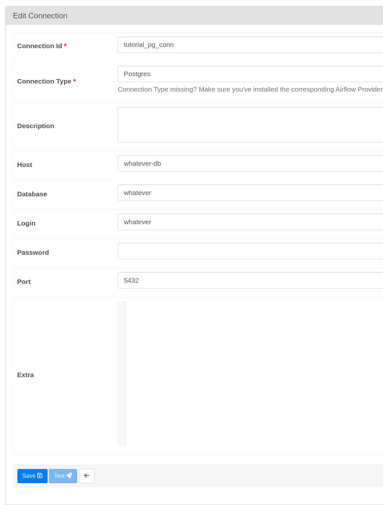

# Hacking on Airflow


## Before running

```
# Make supporting folders
mkdir -p ./logs ./plugins

# Build the docker image (with custom Python packages)
docker compose build
```

## Usage

```
docker compose up -d
```

Wait patiently and visit <http://localhost:8080/>. Username/password is
`airflow`.

You should see one DAG; `process employees`.

## Setup

You need to add a connection first; in the "Admin" tab. It should be called
`tutorial_pg_conn` and look like this:



## Running

Click play on the Dag; it should run and create the tables in the database.
